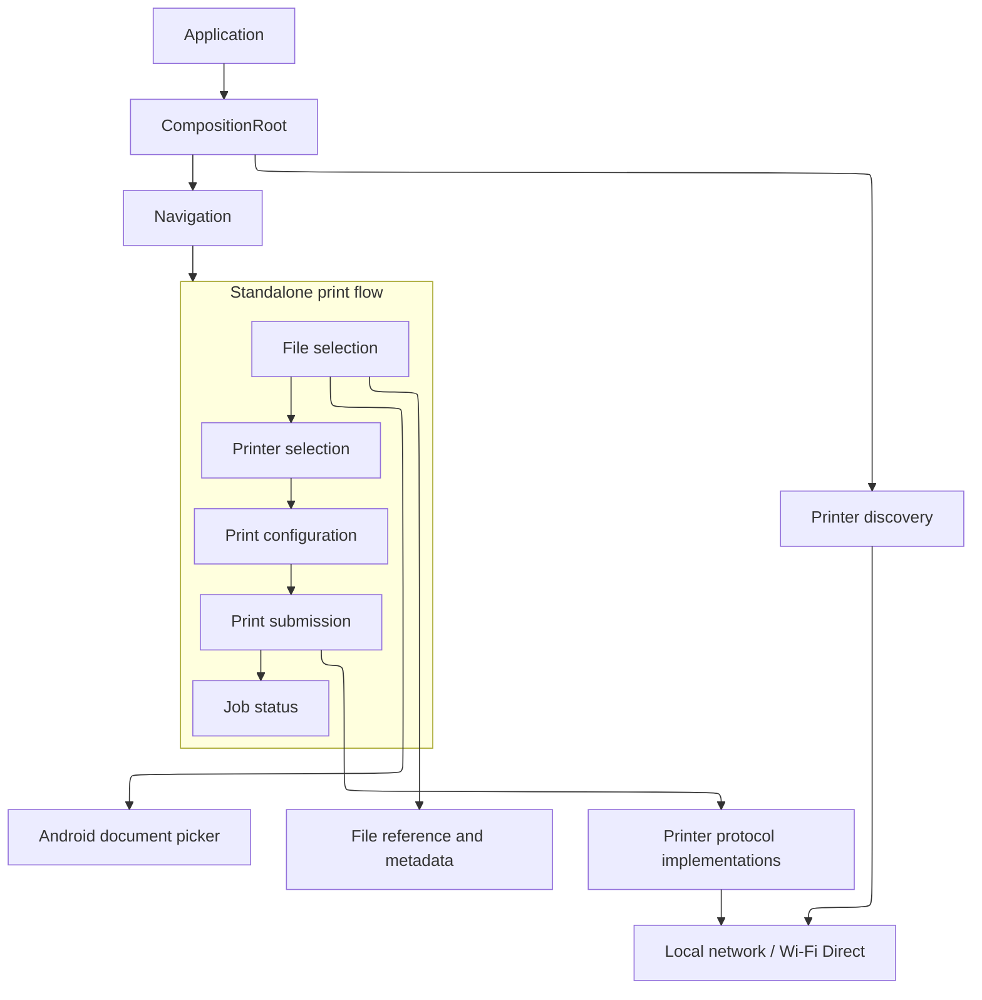

# Architecture

Use Mermaid with the ELK layout for all architecture diagrams in this document.

## Purpose

Impresso is a local-first Android application for printing documents and images to
printers available on the local network or through Wi-Fi Direct.

The architecture aims to keep the default printing experience simple while allowing
printer protocols, connection mechanisms, file formats, and Android entry points to
evolve independently.

The application currently uses a single Android module. Package and layer boundaries
should remain clear without introducing additional Gradle modules prematurely.

## Principles

- Keep document and printer data local. Do not use cloud services, accounts, remote
  copies, or Internet fallbacks.
- Prefer Android platform capabilities over broad permissions or custom storage
  access.
- Keep platform-specific concerns behind stable application boundaries.
- Keep business rules independently testable from the UI and Android framework.
- Keep transient flow state in memory unless a later specification explicitly requires
  persistence.
- Make asynchronous work lifecycle-aware and cancellable.
- Keep file selection independent from printer availability.
- Support new printer brands, protocols, formats, and connection types through
  replaceable implementations.

## Data and State

### Application Boundaries

The application is organized around three conceptual areas:

- Presentation: screens, navigation, and user-facing state.
- Domain: printing-flow rules and stable contracts.
- Data/platform: Android document access, local connectivity, and printer protocol
  implementations.

The exact package and class structure belongs in feature implementation plans under
`plan/`, not in this document.

### State Ownership

- Screen state is owned by the relevant presentation component.
- The active standalone print flow owns its transient selection and configuration.
- Printer discovery is owned by an application-level discovery component so it can
  begin before the user reaches printer selection.
- Printer discovery must not block file selection or file validation.
- Cross-screen handoff uses application-defined data contracts rather than leaking
  platform implementation details through navigation.

### External Data

- Android document providers supply file references and metadata.
- Local network and Wi-Fi Direct supply printer connectivity.
- Printer implementations supply discovery results, submission results, and available
  job status.

No external service is required for the core application flow.

### Persistence and Privacy

- Selected files and print-flow state are not restored after the flow ends.
- No print history or persistent queue exists in the initial architecture.
- File references are retained only for the lifetime needed by the active flow.
- URI access is managed through Android's granted permissions and released when the
  flow ends.
- No broad storage access is required.
- Document content must not be sent outside the local network.

## Key Decisions

### Single Application Module

Keep the initial implementation in one `app` module with clear conceptual layers.
Extract additional modules only when independent ownership, build performance, or
reusable functionality justifies the cost.

### Compose-Based Presentation

Use Jetpack Compose as the UI foundation. Presentation components should render state
and send user events to the relevant state holder rather than embedding business rules
or platform access in composables.

### Explicit State Management

Use ViewModels and observable state for asynchronous or flow-level behavior. This keeps
state separate from the Android activity lifecycle and allows business and state
transitions to be tested independently of rendering.

### Navigation Boundary

Use Navigation Compose for the application flow. Navigation routes should carry only
small, stable arguments. File references and other flow data should be transferred
through typed application contracts owned by the active flow.

### Manual Composition Root

Construct application dependencies explicitly from the application composition root.
Do not introduce a dependency-injection framework until the object graph creates a
concrete maintenance or testing problem.

### Local Document Access

Use the Android system document picker rather than direct filesystem access or broad
storage permissions. Returned references must be validated locally before they enter
the printing flow.

### Parallel Printer Discovery

Start printer discovery at application startup through an application-level component.
Discovery runs in parallel with file selection to reduce perceived latency. File
selection remains usable when discovery is still running, fails, or returns no printers.

Discovery-specific protocols, permissions, timeouts, retries, and empty states belong
to the IMP-03 and IMP-05 specifications and implementation plans.

### Extensible Printer Connectivity

Keep printer discovery, printer selection, connectivity, and printer protocols behind
replaceable contracts. The initial Epson validation target must not determine the
application-wide architecture or prevent support for other implementations.
