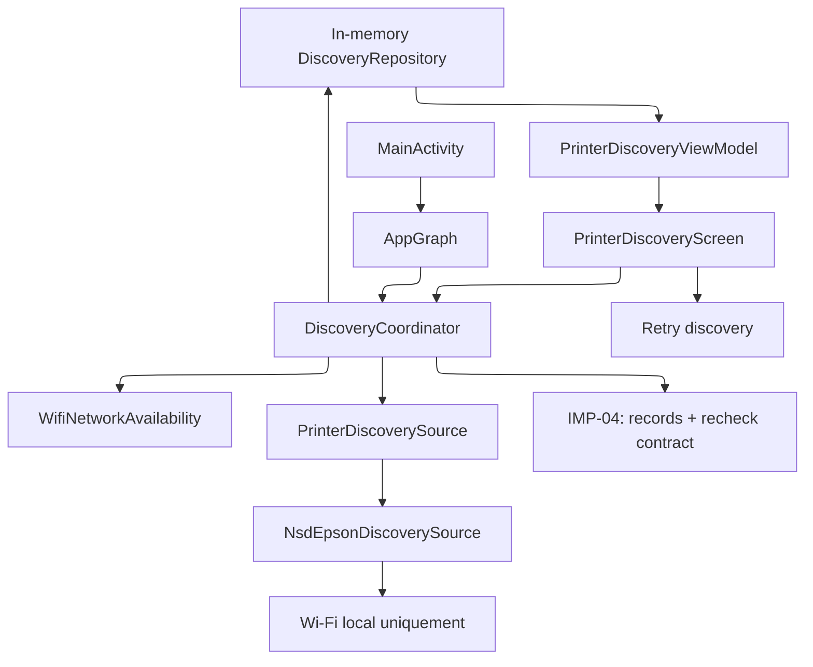
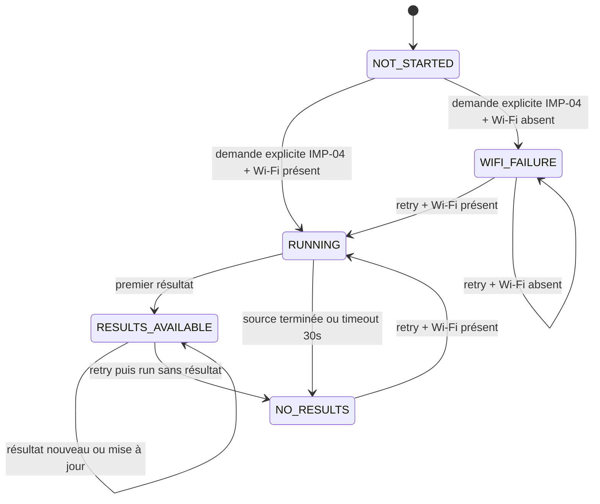

# Plan d'implémentation — IMP-03 : découverte automatique des imprimantes locales

**Statut :** plan accepté
**Issue :** [zemoa/Impresso#1](https://github.com/zemoa/Impresso/issues/1)
**Spécification :** [`spec/03-discover-local-printers.md`](../spec/03-discover-local-printers.md)

## 1. Résumé technique de la feature

Remplacer le `NoOpDiscoveryCoordinator` actuel par un coordinateur applicatif
lifecycle-aware qui pourra démarrer une découverte sur le Wi-Fi local à la demande du
flux de sélection, publie les résultats progressivement, déduplique les imprimantes,
les conserve en mémoire pendant la session et termine chaque exécution après au
plus 30 secondes. Ajouter l'écran Compose consommé par IMP-04, son état observable,
le bouton de retry et les états Wi-Fi absent / aucun résultat / découverte en cours.

Le MVP cible l'Epson XP-6000 Series, mais l'écran et le domaine ne doivent dépendre
ni de la marque ni d'un protocole concret. Aucune recherche Internet, aucun cloud et
aucun stockage durable des résultats ne seront ajoutés.

### Critères d'acceptation couverts

- infrastructure préparée au lancement, sans démarrer NSD ni afficher de popup de
  recherche ou de sélection ; démarrage explicite par le futur flux IMP-04 ;
- résultats affichés dès réception, tous présents et sans doublons ;
- nom, modèle, adresse réseau, origine locale et état `active`/`inactive` exposés ;
- durée maximale de 30 secondes ;
- retry manuel qui vide l'affichage avant de relancer ;
- résultats conservés lors des changements d'écran / retour au premier plan ;
- échec Wi-Fi immédiat avec indication et action de retry ;
- contrat de revalidation utilisable par IMP-04 ;
- découverte limitée au réseau Wi-Fi local.

## 2. État actuel du code concerné

### Faits observés

- Le coordinateur est construit par `Application` mais reste inactif au lancement ; aucun
  écran ou popup de recherche/sélection n'est affiché avant l'intégration IMP-04.
- `DiscoveryCoordinator` ne possède actuellement que `start()` et `stop()` ;
  `NoOpDiscoveryCoordinator` est encore utilisé par `AppGraph`.
- La route `printer-discovery` affiche seulement
  `PrinterDiscoveryPlaceholder` et reçoit le fichier via `PrintFlowViewModel`.
- `PrintFlowViewModel` conserve le fichier validé en `StateFlow`, sans contrat
  d'imprimante.
- Le projet est un seul module Android, Kotlin/Compose, minSdk 24 ; aucune
  dépendance de découverte réseau n'est présente.
- Les tests existants couvrent seulement IMP-01 (ViewModel et écran de sélection de
  fichier). Aucun test réseau, de coordinateur ou d'écran imprimantes n'existe.

### Contraintes de la spécification

Les résultats sont transitoires, la découverte Wi-Fi Direct est explicitement exclue,
la sélection / persistance de l'imprimante appartient à IMP-04, et l'écran doit rester
utilisable sans fichier sélectionné.

## 3. Hypothèses, contraintes et questions ouvertes

### Décisions proposées

1. Utiliser l'API Android NSD/mDNS (`NsdManager`) derrière un adaptateur data. C'est
   l'option la plus petite et la plus native pour les services publiés sur le LAN,
   sans ajouter de bibliothèque ou de service externe.
2. Faire de la liste de types DNS-SD (`_ipp._tcp`, puis le type Epson validé sur le
   matériel) une configuration de l'adaptateur, et non une règle du domaine. Le type
   réellement annoncé par l'XP-6000 doit être confirmé sur un appareil avant codage
   final ; si NSD ne permet pas de détecter ce modèle, créer un second
   `PrinterDiscoverySource` Epson remplaçable sans modifier UI/domaine.
3. Utiliser `ACCESS_NETWORK_STATE` pour le pré-contrôle Wi-Fi et `INTERNET` pour les
   échanges locaux. Ne pas demander d'accès stockage, localisation ou Wi-Fi Direct.
   La nécessité d'un multicast lock devra être vérifiée sur appareil Android réel,
   puis limité à la durée de la découverte si indispensable.
4. Dédupliquer d'abord par identifiant DNS-SD stable ; sinon par adresse + port +
   nom/modèle normalisés. Cette clé sera documentée dans le contrat et testée.

### Résultat des recherches réseau

Les sources publiques consultées confirment que le modèle XP-6000 supporte AirPrint
(page de support Epson et guide utilisateur Epson ; la documentation mentionne aussi
la configuration réseau et Wi-Fi). AirPrint repose sur Bonjour, donc sur mDNS/DNS-SD,
pour annoncer une imprimante sur le LAN. La documentation CUPS confirme le modèle de
services généralement utilisé pour ce cas : `_ipp._tcp` (et éventuellement `_ipps._tcp`)
avec résolution du nom, port et attributs TXT.

En revanche, les pages publiques accessibles ne donnent pas le TXT exact de cet appareil
ni la preuve que chaque variante/région publie le même service. Le type DNS-SD exact doit
donc être validé par une capture mDNS sur une XP-6000 réelle. Le plan retient `_ipp._tcp`
comme premier candidat, sans exclure `_ipps._tcp`; il ne faut pas implémenter un scan de
tous les ports ni une recherche Internet.

Sources consultées :

- [Support Epson XP-6000](https://epson.com/Support/Printers/All-In-Ones/XP-Series/Epson-XP-6000/s/SPT_C11CG18201)
  — présence de questions/réponses AirPrint et de support IP sur réseau sans fil ;
- [Guide utilisateur Epson XP-6000](https://support2.epson.net/manuals/english/spc/xp_6000_6001/pdf/npd5776-01.pdf)
  — guide officiel réseau/AirPrint, PDF ;
- [CUPS — Using Network Printers](https://www.cups.org/doc/network.html)
  — découverte Bonjour/DNS-SD et exemples `_ipp._tcp`, `_ipps._tcp`,
  `_pdl-datastream._tcp`.

### Décision de plan mise à jour

Commencer par une source Android NSD ciblant `_ipp._tcp`, avec prise en charge de
`_ipps._tcp` et filtrage des résultats dont les données identifient une imprimante.
L'étape de validation matérielle doit capturer le service réellement publié par la
XP-6000 et ajuster uniquement la configuration de la source (type, parsing TXT et
revalidation). Si la XP-6000 n'annonce aucun service AirPrint exploitable, ouvrir une
investigation séparée sur le protocole Epson propriétaire ; ne pas le déduire du seul
nom du modèle.

## 4. Design technique proposé

### Contrats et flux

- `DiscoveredPrinter` (domain) contient `id`, `name?`, `model?`, `networkAddress?`,
  `port?`, `availability`, `origin = LOCAL_WIFI`.
- `PrinterAvailability` est une enum `ACTIVE` / `INACTIVE`.
- `DiscoveryState` contient l'état de run (`NOT_STARTED`, `RUNNING`, `RESULTS_AVAILABLE`,
  `NO_RESULTS`, `WIFI_FAILURE`) et la liste ordonnée des records.
- `PrinterDiscoverySource` expose un `Flow<DiscoveryEvent>` ou une méthode suspendue
  cancellable qui émet chaque résultat, puis se ferme ; elle ne connaît pas Compose.
- `DiscoveryCoordinator` expose un `StateFlow<DiscoveryState>`, `start()`, `retry()` et
  `recheck(printer): Result<Boolean>`/contrat équivalent pour IMP-04. `start()` est
  idempotent ; `retry()` annule le run précédent, vide la liste et recrée un run.
- `InMemoryDiscoveryRepository` possède l'unique collection de session et applique la
  déduplication / mise à jour d'état. Aucun fichier, DataStore ou SharedPreferences.
- `PrinterDiscoveryViewModel` transforme le domaine en UI et déclenche `retry`; sa
  coroutine est annulée avec `viewModelScope`, sans arrêter le coordinateur en quittant
  l'écran.

### États et transitions

Les mises à jour concurrentes sont sérialisées dans le coordinateur / repository.
Le timeout utilise `withTimeoutOrNull(30.seconds)` et la source est toujours fermée
dans `finally`. Une annulation lifecycle ne doit pas transformer artificiellement un
run en erreur utilisateur.

## 5. Liste des fichiers à modifier ou créer

### À modifier

- `app/src/main/java/net/zemoa/impresso/app/DiscoveryCoordinator.kt` : remplacer le
  contrat no-op par le coordinateur observable et brancher la durée, le retry et la
  revalidation.
- `app/src/main/java/net/zemoa/impresso/app/AppGraph.kt` : construire explicitement
  le détecteur Wi-Fi, repository, source Epson et coordinateur.
- `app/src/main/java/net/zemoa/impresso/MainActivity.kt` : remplacer le placeholder
  par `PrinterDiscoveryScreen`, conserver la route et partager la source de données
  de session.
- `app/src/main/AndroidManifest.xml` : déclarer uniquement les permissions réseau
  retenues après vérification Android.
- `app/src/main/res/values/strings.xml` : chaînes anglaises pour titre, chargement,
  Wi-Fi absent, aucun résultat, état actif/inactif, identifiants et retry.
- `app/src/main/res/values-fr/strings.xml` : traductions françaises correspondantes.

### À créer

- `.../print/domain/DiscoveredPrinter.kt` : modèle et enums stables transmis à IMP-04.
- `.../print/domain/PrinterDiscoverySource.kt` : contrat extensible de découverte et
  événement de résultat.
- `.../print/domain/PrinterDiscoveryRepository.kt` : contrat de session et clé de
  déduplication.
- `.../print/data/InMemoryPrinterDiscoveryRepository.kt` : stockage temporaire,
  déduplication et mises à jour.
- `.../print/data/AndroidWifiNetworkAvailability.kt` : vérification de connexion Wi-Fi.
- `.../print/data/NsdEpsonPrinterDiscoverySource.kt` : adaptation `NsdManager`,
  résolution des services, mapping des données et revalidation locale.
- `.../print/presentation/discovery/PrinterDiscoveryUiState.kt` : projection UI testable.
- `.../print/presentation/discovery/PrinterDiscoveryViewModel.kt` : orchestration UI,
  retry et collecte lifecycle-aware.
- `.../print/presentation/discovery/PrinterDiscoveryScreen.kt` : liste progressive,
  états vides/erreur et accessibilité Compose.
- `app/src/test/.../print/domain/DiscoveredPrinterTest.kt` et tests repository /
  coordinateur / ViewModel.
- `app/src/androidTest/.../print/presentation/discovery/PrinterDiscoveryScreenTest.kt` :
  tests d'affichage, retry, états et accessibilité de base.

Les noms exacts de package `data` peuvent suivre les packages existants ; aucune
dépendance Gradle ne doit être ajoutée sans approbation explicite.

## 6. Plan d'implémentation numéroté et détaillé

### 1. Figer le contrat de domaine et la déduplication

- **Fichier/zone :** nouveaux fichiers domain `DiscoveredPrinter.kt`,
  `PrinterDiscoverySource.kt`, `PrinterDiscoveryRepository.kt`.
- **Comportement :** définir les modèles immuables, états et événements nécessaires
  aux résultats progressifs, à l'origine locale et à la revalidation.
- **Entrées/sorties :** entrée = événement de source avec informations optionnelles ;
  sortie = record normalisé avec identifiant de session stable.
- **Erreurs/cas limites :** informations manquantes acceptées ; identifiant vide refusé
  ou remplacé par la clé de fallback ; résultats identiques idempotents.
- **Tests :** tests de normalisation, clé primaire/fallback et conservation des champs.
- **Terminé quand :** IMP-04 peut dépendre de types domain sans importer Android NSD.

### 2. Implémenter le repository mémoire

- **Fichier/zone :** `InMemoryPrinterDiscoveryRepository.kt`.
- **Comportement :** ajouter/remplacer sans doublon, conserver l'ordre d'arrivée,
  marquer une imprimante inactive sans la supprimer, vider explicitement au retry,
  exposer un `StateFlow`.
- **Entrées/sorties :** `DiscoveryResult` -> collection observable ; `clear()` -> liste
  vide.
- **Erreurs/cas limites :** émissions concurrentes sérialisées ; changement de données
  d'une même clé met à jour le record au lieu d'en créer un second.
- **Tests :** premier résultat, doublon, données enrichies, inactive conservée, clear.
- **Terminé quand :** tous les tests repository passent sans Android framework.

### 3. Ajouter la détection de réseau et la source Epson

- **Fichiers/zone :** `AndroidWifiNetworkAvailability.kt`,
  `NsdEpsonPrinterDiscoverySource.kt`.
- **Comportement :** vérifier Wi-Fi avant NSD ; découvrir/résoudre les services Epson
  confirmés ; mapper nom/modèle/adresse/port ; permettre une revalidation cancellable.
- **Entrées/sorties :** `Context` et types de service -> flux de records ; adresse/port
  -> réponse active/inactive.
- **Erreurs/cas limites :** Wi-Fi absent immédiat ; échec NSD, service malformé,
  résolution interrompue et timeout deviennent un flux terminé sans résultat ; fermer
  discovery listeners et éventuel multicast lock dans `finally`.
- **Tests :** faux adaptateurs NSD et Wi-Fi ; succès progressif, absence Wi-Fi, erreur,
  annulation et revalidation. Un test appareil réel doit confirmer le type DNS-SD de
  l'XP-6000.
- **Terminé quand :** aucune opération réseau n'utilise une URL distante et l'adaptateur
  est remplaçable par une autre source.

### 4. Orchestrer le cycle de découverte

- **Fichier/zone :** `DiscoveryCoordinator.kt`.
- **Comportement :** `start()` une seule fois par demande de session ; lancer en
  arrière-plan uniquement après demande explicite, collecter progressivement, appliquer
  le timeout 30 s, publier les états ; `retry()`
  annule/clear/revérifie Wi-Fi et relance.
- **Entrées/sorties :** appels start/retry/recheck -> `StateFlow<DiscoveryState>` et
  résultat de revalidation.
- **Erreurs/cas limites :** retry pendant un run annule l'ancien ; absence de résultat
  après timeout = `NO_RESULTS`, Wi-Fi absent = `WIFI_FAILURE`, annulation de l'app
  silencieuse ; ne jamais faire de retry automatique au retour foreground.
- **Tests :** idempotence start, résultats progressifs, timeout, retry clear-first,
  Wi-Fi failure, annulation et sortie d'écran.
- **Terminé quand :** le coordinateur satisfait tous les scénarios de la section 8 de
  la spécification avec des fakes déterministes.

### 5. Brancher le graphe applicatif et le démarrage

- **Fichiers/zone :** `AppGraph.kt`, `MainActivity.kt`, `AndroidManifest.xml`.
- **Comportement :** injecter une seule instance de coordinateur au niveau application,
  la laisser inactive au lancement puis la démarrer sur demande explicite, conserver les
  résultats pour la session et déclarer les permissions minimales.
- **Entrées/sorties :** `applicationContext` -> object graph partagé par la route.
- **Erreurs/cas limites :** l'ouverture de l'application ne doit lancer aucun scan ni
  afficher de popup de recherche ou de sélection ; la recréation de l'activité ne doit pas effacer les
  résultats ni relancer la découverte ; permissions refusées / absence Wi-Fi doivent
  produire l'état prévu, pas un crash.
- **Tests :** test d'intégration du graphe avec fakes ; test d'idempotence du cycle
  activité ; inspection du manifest.
- **Terminé quand :** `NoOpDiscoveryCoordinator` n'est plus le binding de production.

### 6. Créer l'état et l'écran Compose

- **Fichiers/zone :** nouveaux fichiers `PrinterDiscoveryUiState.kt`,
  `PrinterDiscoveryViewModel.kt`, `PrinterDiscoveryScreen.kt`; modification de
  `MainActivity.kt`.
- **Comportement :** exposer les records déjà découverts quand cet écran sera intégré par
  la fonctionnalité de sélection, sans démarrer une nouvelle recherche depuis l'UI.
  Afficher les champs disponibles et un état lisible ; ne pas implémenter de sélection.
- **Entrées/sorties :** `DiscoveryState` -> UI ; clic retry -> coordinateur.
- **Erreurs/cas limites :** liste vide pendant le chargement distincte de no results,
  Wi-Fi failure distinct de no results, textes accessibles et content descriptions,
  rotation sans duplication.
- **Tests :** tests Compose pour l'affichage ultérieur, résultats multiples, doublons,
  états vides, retry et champs absents ; test ViewModel de projection et collecte.
- **Terminé quand :** le placeholder est supprimé et l'écran reste utilisable sans fichier.

### 7. Ajouter traductions et documentation d'intégration IMP-04

- **Fichiers/zone :** `strings.xml`, `values-fr/strings.xml`, modèles/contrats et
  éventuellement `spec/03-discover-local-printers.md` pour consigner le protocole confirmé.
- **Comportement :** toutes les chaînes visibles sont des resources, anglais fallback,
  français complet ; documenter le contrat de revalidation et la clé d'identité.
- **Entrées/sorties :** resources Android -> affichage localisé ; record domain -> handoff
  consommable par IMP-04.
- **Erreurs/cas limites :** aucun texte codé en dur, aucun résultat persistant ou exporté.
- **Tests :** tests de resources anglaises/françaises et vérification des libellés clés.
- **Terminé quand :** les critères de localisation/privacy de la spec sont vérifiables.

## 7. Stratégie de tests par étape

| Étape | Tests principaux | Niveau |
| --- | --- | --- |
| 1 | modèle, états, clé de déduplication | unit |
| 2 | add/update/duplicate/clear/active-inactive | unit |
| 3 | fakes Wi-Fi/NSD, mapping, timeout source, close/annulation | unit + appareil |
| 4 | transitions, retry, durée maximale, start idempotent | unit coroutine |
| 5 | composition root et cycle de vie | intégration |
| 6 | rendu progressif, états, bouton retry, accessibilité | instrumented Compose |
| 7 | resources EN/FR et non-régression IMP-01 | instrumented + unit |

Le développement doit suivre le TDD du projet : écrire le test de chaque transition
avant son implémentation. Les tests réseau ne doivent pas dépendre d'une imprimante
réelle ; le test matériel Epson est une validation fonctionnelle séparée.

## 8. Critères de vérification finaux

1. Exécuter `./gradlew test`.
2. Exécuter `./gradlew assembleDebug`.
3. Exécuter les tests instrumentés disponibles, notamment le test Compose discovery,
   sur émulateur ou appareil Android.
4. Exécuter ktlint et detekt si leurs tâches sont présentes dans le projet ; si elles
   sont introduites par cette feature, documenter les tâches exactes sans ajouter de
   plugin non approuvé.
5. Sur le réseau local de test : vérifier un XP-6000, plusieurs réponses, doublons,
   absence d'imprimante, Wi-Fi coupé, timeout 30 s et disparition d'une imprimante.
6. Vérifier que l'ouverture de l'application n'affiche aucun popup de recherche ou de
   sélection, que la sélection de fichier reste utilisable pendant la découverte et que
   l'écran ultérieur réutilise les résultats sans nouveau scan automatique.
7. Inspecter le manifest et les logs réseau pour confirmer l'absence d'hôte Internet,
   de cloud, de compte et de persistance des résultats.

## 9. Risques, régressions possibles et prévention

- **Type de service Epson inconnu :** confirmer l'annonce de l'XP-6000 avant de figer
  l'adaptateur ; garder les types configurables et isoler un éventuel protocole Epson.
- **Limites NSD / multicast selon version Android :** encapsuler `NsdManager`, libérer
  listeners/lock, tester sur appareil réel API 24 et version cible.
- **Doublons après résolution d'adresse :** clé stable prioritaire et tests de résultats
  répétés / informations enrichies.
- **Fuite de coroutine ou listener :** `SupervisorJob`/scope applicatif contrôlé,
  `withTimeout`, annulation et nettoyage dans `finally`.
- **Relaunch intempestif :** instance du coordinateur dans `AppGraph`, `start`
  idempotent, aucun déclenchement au lancement, depuis la recomposition ou le retour
  foreground.
- **Confusion IMP-03/IMP-04 :** ne pas ajouter sélection, persistance de préférences,
  Wi-Fi Direct ou soumission ; exposer seulement les records et revalidation.
- **Régression de navigation/file selection :** conserver la route et le handoff du
  `PrintFlowViewModel`, remplacer uniquement le placeholder et ajouter des tests de
  coexistence.
- **Accessibilité/localisation oubliées :** resources obligatoires, semantics Compose,
  tests d'existence des actions et états clés en anglais et français.
