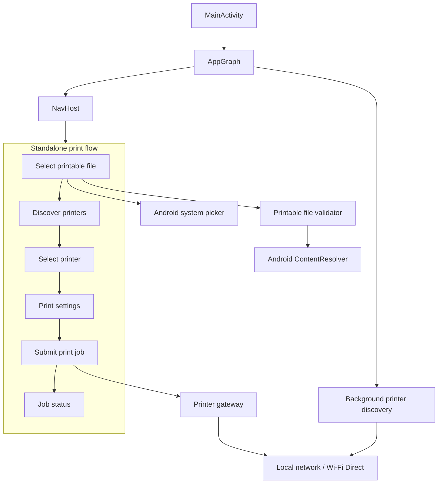
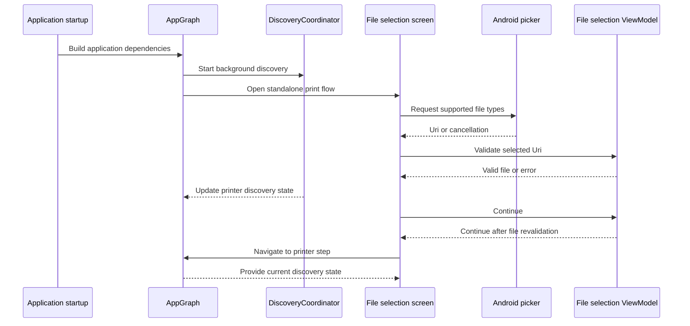
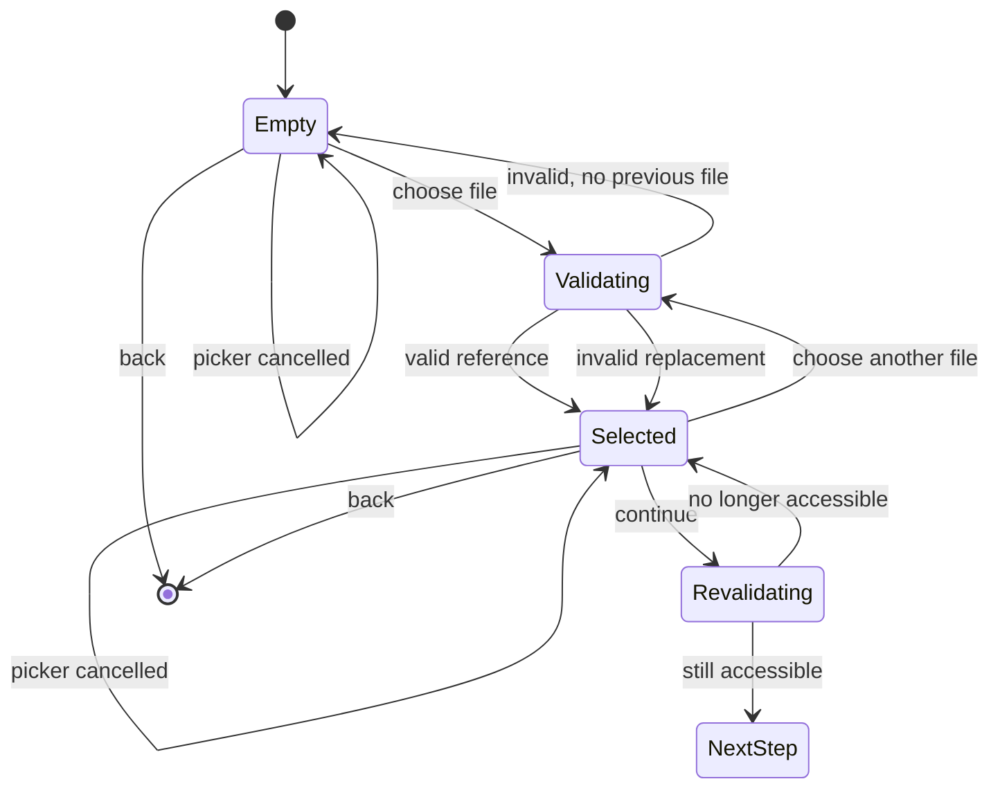

# IMP-01 Implementation Plan: Select a Printable File

## Mission

Implement the first step of Impresso's standalone printing flow.

The user must be able to select exactly one supported local file, validate its declared type and accessibility, see the selected file metadata, replace it, and continue to the printer-discovery step.

Do not implement printer discovery, printer selection, print settings, document conversion, print submission, persistence, print history, cloud services, or broad storage permissions as part of IMP-01.

## Architectural Decisions

| Area | Decision |
| --- | --- |
| UI | Jetpack Compose |
| Project structure | One Gradle module (`app`) with clear layers and feature packages |
| UI state | `ViewModel` + `StateFlow` |
| Android picker | `ACTION_OPEN_DOCUMENT` through `OpenDocument` |
| URI permission | Persistable read permission retained only for the current print flow |
| Validation | Validate the declared type, resolve metadata, and open the URI for reading |
| Navigation | Navigation Compose |
| Dependency injection | Manual composition root; do not add a DI framework |
| Handoff | Typed result containing URI, display name, and canonical file type |
| Error presentation | Persistent inline error with an actionable message |
| MIME resolution | MIME first; extension fallback only when MIME is absent or unusable |
| Domain type | Canonical enum: `PDF`, `JPEG`, `PNG`, `GIF`, `WEBP`, `DOCX`, `ODT` |
| Printer discovery | App-scoped background coordinator started during application startup |
| Discovery relationship | Discovery is non-blocking and independent from file selection |

The approved AndroidX Compose, Navigation Compose, lifecycle, and Compose test dependencies may be added. Do not add unrelated dependencies.

## Global Architecture

The repository is currently a minimal Android skeleton with one `app` module, no Kotlin application classes, no navigation, and an AppCompat/Material baseline. Keep the implementation simple while establishing boundaries for future printing features.



Printer discovery starts at application startup through `AppGraph` and runs independently. Its concrete implementation belongs to IMP-03. IMP-01 only defines the boundary and ensures that file selection does not wait for discovery.

## Suggested Package Structure

```text
app/src/main/java/net/zemoa/impresso/
├── App.kt
├── MainActivity.kt
├── app/
│   ├── AppGraph.kt
│   └── navigation/
├── print/
│   ├── domain/
│   │   ├── PrintableFileType.kt
│   │   ├── PrintableFile.kt
│   │   ├── FileReferenceValidator.kt
│   │   └── ValidatePrintableFileUseCase.kt
│   ├── data/
│   │   ├── AndroidFileReferenceValidator.kt
│   │   ├── ContentResolverMetadataReader.kt
│   │   └── UriPermissionManager.kt
│   └── presentation/
│       └── selectfile/
│           ├── SelectPrintableFileScreen.kt
│           ├── SelectPrintableFileViewModel.kt
│           ├── SelectPrintableFileUiState.kt
│           └── SelectPrintableFileEvent.kt
└── shared/
    └── ui/
```

Future printer features should depend on domain contracts rather than directly on `ContentResolver`, Compose, or other Android implementation details.

## Domain Model

```kotlin
enum class PrintableFileType {
    PDF,
    JPEG,
    PNG,
    GIF,
    WEBP,
    DOCX,
    ODT
}

data class PrintableFile(
    val uri: Uri,
    val displayName: String,
    val type: PrintableFileType,
    val declaredMimeType: String?
)
```

`PrintableFile` must contain only the data required by the current local print flow:

- The Android `Uri` reference.
- The provider-supplied display name.
- The canonical supported type.
- The declared MIME type, when available.

Never load the complete file into memory during this feature.

## Validation Contract

```kotlin
interface FileReferenceValidator {
    suspend fun validate(uri: Uri): ValidationResult
}
```

The validator must:

1. Read the declared MIME type using `ContentResolver.getType(uri)`.
2. Resolve the display name using `OpenableColumns.DISPLAY_NAME`.
3. Map the file to a canonical `PrintableFileType`.
4. Use the extension only when the MIME type is absent or unusable.
5. Reject an explicitly unsupported MIME type even when the extension appears supported.
6. Open the URI for reading using `openInputStream()` or `openAssetFileDescriptor()`.
7. Close the stream immediately after the accessibility check.
8. Return a typed error for an unsupported type, inaccessible URI, or unavailable metadata.

Do not add document-structure validation, password detection, encryption detection, file-size limits, conversion, or content upload.

### Supported Formats

| Canonical type | MIME | Extensions |
| --- | --- | --- |
| `PDF` | `application/pdf` | `.pdf` |
| `JPEG` | `image/jpeg` | `.jpg`, `.jpeg` |
| `PNG` | `image/png` | `.png` |
| `GIF` | `image/gif` | `.gif` |
| `WEBP` | `image/webp` | `.webp` |
| `DOCX` | `application/vnd.openxmlformats-officedocument.wordprocessingml.document` | `.docx` |
| `ODT` | `application/vnd.oasis.opendocument.text` | `.odt` |

The provider's `DISPLAY_NAME` is the source of truth for the displayed name. If no usable name can be resolved, reject the reference rather than displaying a misleading URI-derived name.

## Application Startup and Parallel Work

Discovery is started during complete application startup. It is owned by an app-scoped `DiscoveryCoordinator`, not by the file-selection screen.



Rules:

- A valid file can continue while discovery is still running.
- A discovery error does not prevent file selection or continuation.
- Zero discovered printers does not prevent file selection or continuation.
- Discovery progress, empty state, retry behavior, and network errors belong to IMP-03/IMP-05.
- Cancel in-progress discovery when the entire application print flow exits or completes.

## Selection State



Recommended state model:

```kotlin
sealed interface SelectPrintableFileUiState {
    data object Empty : SelectPrintableFileUiState

    data class Validating(
        val previousSelection: PrintableFile?
    ) : SelectPrintableFileUiState

    data class Selected(
        val file: PrintableFile,
        val error: SelectionError? = null
    ) : SelectPrintableFileUiState

    data class Error(
        val previousSelection: PrintableFile?,
        val error: SelectionError
    ) : SelectPrintableFileUiState
}
```

A replacement is transactional. The previous selection remains active until the new URI passes validation. Cancellation or rejection must never erase a valid previous selection.

## Android Picker

Use `ACTION_OPEN_DOCUMENT` through `ActivityResultContracts.OpenDocument` with:

- `Intent.CATEGORY_OPENABLE`.
- `Intent.EXTRA_MIME_TYPES` containing the seven supported MIME types.
- `Intent.FLAG_GRANT_READ_URI_PERMISSION`.
- `Intent.FLAG_GRANT_PERSISTABLE_URI_PERMISSION`.

Use `*/*` as the primary type if required for cross-provider compatibility, while still passing `EXTRA_MIME_TYPES`. The returned URI must always pass local validation because a provider may ignore or bypass the picker filter.

Handle `ActivityNotFoundException` or an equivalent picker-launch failure with a dedicated inline error. Never simulate a selected file.

The picker launcher must be behind a small testable boundary so ViewModel tests do not depend on Android activity-result behavior.

## Navigation and Handoff

Return a typed result from the file-selection destination:

```kotlin
sealed interface SelectFileResult {
    data class Success(val file: PrintableFile) : SelectFileResult
    data object Cancelled : SelectFileResult
}
```

Do not serialize the URI into a fragile navigation route. The flow owner keeps the validated `PrintableFile` in memory and provides it to IMP-03/IMP-04.

The URI permission must remain valid while the complete print flow is active, including printer discovery and printer selection. Release the permission only when the flow exits or completes.

No singleton, database, `SharedPreferences`, print history, queue, or other persistence mechanism is needed.

## Implementation Sequence

### Phase 1: Prepare the Android Base

- Add only the approved AndroidX Compose, Navigation Compose, lifecycle, and Compose test dependencies.
- Configure Compose and the application theme.
- Create `MainActivity`, `AppGraph`, and the initial navigation destination.
- Create the app-scoped `DiscoveryCoordinator` boundary.
- Keep the concrete discovery implementation in IMP-03.

### Phase 2: Build the Domain Layer

- Create `PrintableFileType` and `PrintableFile`.
- Define typed validation results and error categories.
- Create `FileReferenceValidator`.
- Create `ValidatePrintableFileUseCase`.
- Add unit tests before implementation, following the repository's TDD rule.

### Phase 3: Implement Android File Access

- Implement metadata reading through `ContentResolver`.
- Implement MIME and extension mapping.
- Implement URI read-access validation.
- Implement persistable URI permission acquisition.
- Implement permission cleanup at complete flow exit.
- Add tests using fake resolver/provider boundaries where possible.

### Phase 4: Implement the ViewModel

- Define selection, picker result, cancellation, replacement, and continue events.
- Expose `StateFlow<SelectPrintableFileUiState>`.
- Disable duplicate selection and continuation during validation.
- Preserve the previous selection during replacement.
- Revalidate the selected URI before continuation.
- Emit the typed handoff only after successful revalidation.
- Do not depend on printer discovery state.

### Phase 5: Implement the Compose Screen

- Implement empty, validating, selected, and error states.
- Display the exact provider-supplied file name.
- Display a human-readable type from Android string resources.
- Provide `Choose a file`, `Choose another file`, and `Continue` actions.
- Disable `Continue` until a valid file exists.
- Disable duplicate actions while validation is running.
- Display persistent inline actionable errors.
- Treat picker cancellation as a no-error return to the current state.

### Phase 6: Integrate the Picker

- Use `OpenDocument` with the supported MIME filters.
- Take the returned URI permission when available.
- Pass only the URI into the ViewModel; keep Android picker details out of the domain layer.
- Handle picker unavailability without creating a fake selection.

### Phase 7: Connect the Next Feature

- Emit `SelectFileResult.Success` with URI, display name, and canonical type.
- Navigate to the IMP-03 destination without waiting for discovery completion.
- Read the current discovery state from the app-scoped coordinator.
- Keep the selected file reference available without persistence.

## Tests

### Unit Tests

- Accept PDF.
- Accept JPEG and JPG.
- Accept PNG, GIF, and WebP.
- Accept DOCX.
- Accept ODT.
- Use extension fallback when MIME is absent.
- Reject an explicitly unsupported MIME type.
- Reject an unknown extension.
- Reject an inaccessible URI.
- Reject missing or unusable display metadata.
- Produce the correct `PrintableFile` on success.
- Preserve the previous selection after replacement cancellation.
- Preserve the previous selection after replacement rejection.
- Revalidate before continuation.
- Block continuation when the selected URI becomes inaccessible.
- Block duplicate actions during validation.
- Verify that file selection is independent of discovery progress and failures.

### Compose and Instrumented Tests

- Verify the initial state.
- Verify that `Continue` is disabled without a valid selection.
- Verify the loading state and disabled actions.
- Verify selected name and type rendering.
- Verify successful replacement.
- Verify cancellation during replacement.
- Verify unsupported-file errors.
- Verify inaccessible-file errors.
- Verify picker-unavailable errors.
- Verify navigation only after final URI revalidation.
- Verify continuation while printer discovery is still running.
- Verify multiple document providers and provider filter inconsistencies on a device or emulator.

## Verification Commands

Run the repository-required commands:

```bash
./gradlew assembleDebug
./gradlew test
```

Before review, also run the configured ktlint, detekt, and instrumented test tasks.

## Acceptance Criteria Mapping

The implementation is complete only when it demonstrates:

- The Android picker opens from the initial screen.
- Supported MIME types are requested.
- PDF, JPEG/JPG, PNG, GIF, WebP, DOCX, and ODT can be selected.
- Unsupported and inaccessible references are rejected with actionable messages.
- The selected name and human-readable type are visible.
- `Continue` is disabled before valid selection and enabled afterward.
- Loading prevents duplicate actions.
- Replacement is transactional.
- Picker cancellation preserves the previous selection.
- A URI becoming inaccessible before continuation is detected.
- Back exits the standalone flow.
- No account, server, Internet connection, broad storage permission, upload, or remote copy is used.
- Printer discovery may run in the background without blocking file selection or continuation.

## Follow-up for IMP-03

IMP-03 must define the details intentionally left outside IMP-01:

- Discovery protocol and printer compatibility strategy.
- Network permission requirements by Android version.
- Discovery timeout and retry behavior.
- Empty state when no printer is found.
- Whether results are cached during the application lifetime.
- How discovery errors are represented in the app-scoped coordinator.
